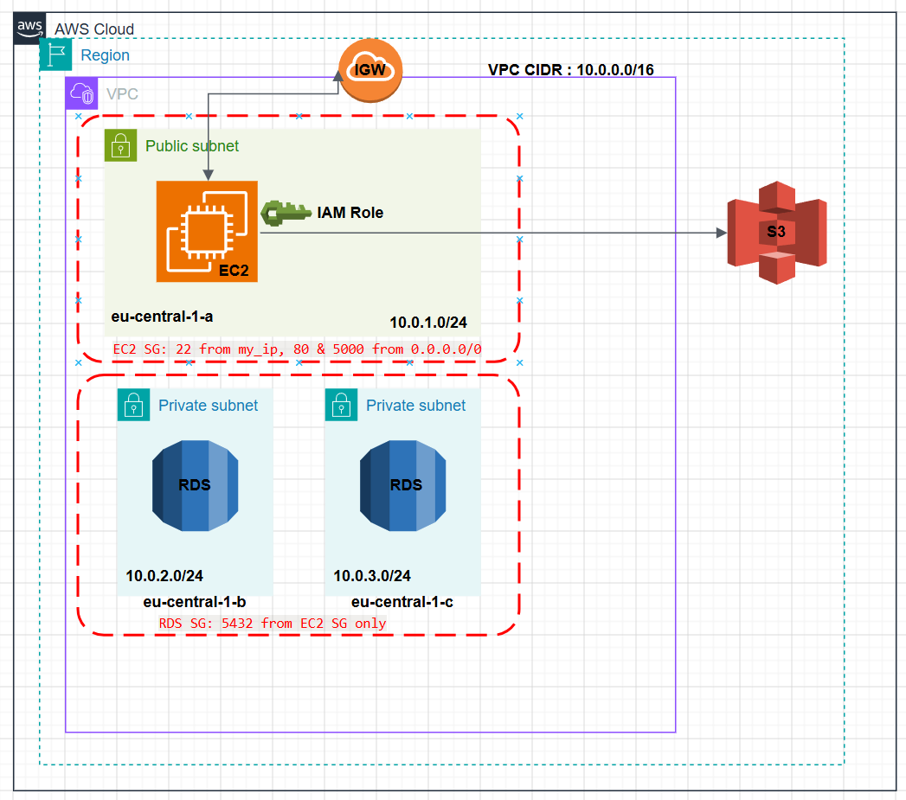

# 🏗️ GroceryMate – AWS Terraform Infrastructure


---

## 📌 Table of Contents

- [Overview](#overview)
- [Architecture Diagram](#architecture-diagram)
- [Architecture Overview](#architecture-overview)
- [Folder Structure](#folder-structure)
- [EC2 Bootstrapping](#ec2-bootstrapping-userdatash)
- [Terraform Usage](#terraform-usage)
  - [Prerequisites](#1-prerequisites)
  - [Configure terraform.tfvars](#2-configure-terraformtfvars)
  - [Initialize and Apply](#3-initialize-and-apply)
- [Accessing the Application](#accessing-the-application)
- [Manual Recovery Guide](#manual-recovery-guide)
- [RDS and Data Seeding](#rds-and-data-seeding)
- [S3 Avatars Bucket](#s3-avatars-bucket)
- [CloudWatch Monitoring and Alerts](#cloudwatch-monitoring-and-alerts)
- [Destroying the Stack](#destroying-the-stack)

---

## 🚀 Overview

This document describes the **GroceryMate AWS infrastructure** managed with Terraform.
It lives under the `infrastructure/` folder and covers:

- VPC, subnets, and networking
- EC2 app server with Docker
- RDS PostgreSQL (private subnets)
- S3 bucket for user avatars
- IAM role and instance profile
- EC2 user data bootstrapping (DB seeding + Docker run)
- CloudWatch alarms and SNS email alerts


---

## 🗺️ Architecture Diagram



---

## 🏛️ Architecture Overview

> 💡 **How to read this section:**
> Think of the architecture as layers. The VPC is the private network boundary. Inside it, the EC2 instance is the only thing exposed to the internet. The RDS database sits in private subnets — it can only be reached from the EC2 instance, never directly from the internet.

- 🔷 **VPC (Virtual Private Cloud)**
  - CIDR: `10.0.0.0/16` — the private network has IP addresses from `10.0.0.0` to `10.0.255.255`
  - DNS support and hostnames enabled so resources can reach each other by name

- 🌐 **Subnets**
  - Public subnet `10.0.1.0/24` in `eu-central-1a` → EC2 app server (internet-facing)
  - Private subnet `10.0.2.0/24` in `eu-central-1b` → RDS (no internet access)
  - Private subnet `10.0.3.0/24` in `eu-central-1c` → RDS (second AZ for high availability requirement)

- 🔗 **Networking**
  - Internet Gateway (IGW) — the door between the VPC and the public internet
  - Public route table: `0.0.0.0/0 → IGW` — all outbound traffic from the public subnet goes through the IGW

- 🔒 **Security Groups** — act like firewalls; they control which traffic is allowed in and out
  - `ec2_sg`:
    - Inbound: SSH `22` from `my_ip` only, HTTP `80` and app port `5000` from anywhere
    - Outbound: all traffic allowed
  - `rds_sg`:
    - Inbound: PostgreSQL `5432` from `ec2_sg` only — only the EC2 instance can connect to the database
    - Outbound: all traffic allowed

- 🖥️ **EC2 App Server**
  - AMI: Amazon Linux 2023 — the operating system image used to create the server
  - Instance type: `t3.micro` — 2 vCPU, 1 GB RAM (free tier eligible)
  - Launched in public subnet with a public IP so users can reach the app
  - IAM instance profile: `grocery-ec2-profile` — gives the EC2 permission to read/write S3 without needing AWS keys in the code

- 🗄️ **RDS PostgreSQL**
  - Engine: `postgres` — managed PostgreSQL database service by AWS
  - Instance class: `db.t3.micro` — small instance, sufficient for development
  - Storage: 20 GB (auto-scales to 100 GB if needed)
  - Not publicly accessible — can only be reached from within the VPC
  - Deployed across two private subnets via DB subnet group — AWS requires at least two AZs for RDS
  - Master user: `postgres` / configured via `var.db_password`

- 🪣 **S3 (Simple Storage Service)**
  - Bucket: `grocerymate-avatars-70223957`
  - Stores user avatar images under `avatars/` prefix
  - Versioning enabled — keeps old versions of files if overwritten
  - Public access blocked — files are only accessible through the application
  - Bucket policy: EC2 IAM role can `ListBucket`, `GetObject`, `PutObject`

- 🐳 **App Container**
  - Repo: `https://github.com/Amerelsabbagh/AWS_grocery` (branch `version2`)
  - Docker image built from `backend/Dockerfile`
  - Container listens on port `5000`

- 📊 **CloudWatch + SNS**
  - Three alarms monitor EC2 CPU, EC2 status checks, and RDS CPU
  - Alerts are sent by email via SNS when thresholds are breached

---

## 📁 Folder Structure

| File | Purpose |
|---|---|
| `main.tf` | VPC, subnets, security groups, EC2, RDS, DB subnet group |
| `variables.tf` | Input variables (region, instance type, CIDRs, DB settings) |
| `iam-role.tf` | EC2 IAM role and instance profile with S3 access |
| `s3.tf` | S3 bucket, versioning, public access block, bucket policy |
| `cloudwatch.tf` | CloudWatch alarms and SNS email alerts |
| `outputs.tf` | EC2 public IP/DNS and RDS endpoint outputs |
| `userdata.sh` | EC2 bootstrap script: installs Docker, seeds DB, runs container |
| `terraform.tfvars` | Environment values (region, key pair, `my_ip`, `db_password`) |
| `architecture.png` | AWS infrastructure architecture diagram |

> 💡 **What is `terraform.tfvars`?**
> This file holds the actual values for variables defined in `variables.tf`. Think of `variables.tf` as declaring what inputs exist, and `terraform.tfvars` as filling in those inputs for your specific environment. This file is **gitignored** because it contains sensitive values like passwords.

---

## ⚙️ EC2 Bootstrapping (userdata.sh)

> 💡 **What is user data?**
> When AWS launches an EC2 instance, you can provide a shell script called "user data" that runs automatically on first boot as root. This is how we automate the entire server setup without manually SSHing in.

On first boot, EC2 automatically runs `userdata.sh` which:

1. 📋 **Sets up logging** — logs to `/tmp/user-data.log` and `/var/log/user-data.log` so you can debug if something goes wrong
2. 📦 **Installs packages** — `git`, `docker`, `postgresql15`, `python3.11`
3. 🐳 **Starts Docker** — enables Docker service, adds `ec2-user` to `docker` group so it can run containers without `sudo`
4. 📥 **Clones the repo** — clones `version2` branch into `/home/ec2-user/AWS_grocery`
5. ⏳ **Waits for RDS** — polls using `RDS_ENDPOINT` until port 5432 is reachable (RDS takes a few minutes to become available)
6. 🗄️ **Creates DB and user** — creates `grocerymate_db` and `grocery_user` if missing, grants full privileges on the `public` schema
7. 📊 **Imports seed data** — imports `sqlite_dump_clean.sql` if no tables exist yet (safe to rerun — skips if tables already exist)
8. 🚀 **Builds and runs container** — builds image `grocerymate` from `backend/`, starts container with host networking and restart policy `unless-stopped`
9. ✅ **Verifies** — runs `SELECT COUNT(*) FROM products` and logs the result to confirm data was imported

---

## 🛠️ Terraform Usage

### 1. Prerequisites

- Terraform `>= 1.5` — [download here](https://developer.hashicorp.com/terraform/downloads)
- AWS CLI installed and credentials configured:

```bash
aws configure
# Enter your AWS Access Key ID, Secret Access Key, region (eu-central-1), output format (json)
```

- An existing EC2 key pair in `eu-central-1` — create one in AWS Console → EC2 → Key Pairs

### 2. Configure terraform.tfvars

Create a file called `terraform.tfvars` inside the `infrastructure/` folder:

```hcl
aws_region        = "eu-central-1"
project_name      = "grocery-app"
ec2_instance_type = "t3.micro"
key_name          = "your-key-name"
my_ip             = "YOUR_PUBLIC_IP/32"
db_password       = "your-secure-password"
alert_email       = "your-email@example.com"
```

> 💡 **How to find your public IP:** Visit [https://checkip.amazonaws.com](https://checkip.amazonaws.com) and add `/32` at the end. Example: `85.214.10.5/32`

> ⚠️ **Never commit `terraform.tfvars` to Git** — it contains your database password. It is already in `.gitignore`.

### 3. Initialize and Apply

```bash
cd infrastructure/
terraform init      # downloads required AWS provider plugins
terraform plan      # shows what will be created (dry run, nothing is created yet)
terraform apply     # creates all resources on AWS (type "yes" to confirm)
```

Terraform will create:

- VPC, subnets, IGW, and route table
- Security groups for EC2 and RDS
- S3 bucket with versioning and bucket policy
- IAM role and instance profile
- RDS PostgreSQL instance
- EC2 app server with user data
- CloudWatch alarms and SNS email subscription

**Outputs after apply:**

| Output | Description |
|---|---|
| `ec2_public_ip` | Public IP of the EC2 instance |
| `ec2_public_dns` | Public DNS of the EC2 instance |
| `rds_endpoint` | RDS PostgreSQL hostname |
| `rds_port` | RDS port (5432) |

> 💡 **How long does it take?**
> - EC2 is ready in ~1 minute
> - RDS takes ~5-10 minutes to become available
> - The full user data script takes another ~3-5 minutes
> - Total: expect ~10-15 minutes before the app is accessible

---

## 🌍 Accessing the Application

After `terraform apply` completes and user data finishes:
http://<ec2_public_ip>:5000


SSH into the instance for debugging:

```bash
ssh -i /path/to/your-key.pem ec2-user@<ec2_public_dns>
```

Useful commands on EC2:

```bash
# Check if user data finished successfully
sudo tail -n 100 /var/log/user-data.log

# Check if the container is running
docker ps

# Check live app logs
docker logs grocerymate-app --tail 100

# Follow app logs in real time
docker logs grocerymate-app -f
```

---

## 🛠️ Manual Recovery Guide

> This section is for when `userdata.sh` fails or the container is not running after EC2 boots.
> Follow these steps to manually bring the app back up without recreating the infrastructure.

### Step 1 — SSH into the EC2 instance

```bash
ssh -i /path/to/your-key.pem ec2-user@<ec2_public_dns>
```

### Step 2 — Check the boot log for errors

```bash
sudo cat /var/log/user-data.log
```

Look for any `ERROR` lines or where the script stopped. This tells you exactly which step failed.

### Step 3 — Check if Docker is running

```bash
sudo systemctl status docker
```

If Docker is not running:

```bash
sudo systemctl start docker
sudo systemctl enable docker
```

### Step 4 — Check if the repo was cloned

```bash
ls /home/ec2-user/AWS_grocery/backend/
```

If the folder is missing or empty, clone it manually:

```bash
cd /home/ec2-user
git clone --branch version2 https://github.com/Amerelsabbagh/AWS_grocery.git
```

### Step 5 — Build the Docker image manually

```bash
cd /home/ec2-user/AWS_grocery/backend
docker build -t grocerymate .
```

> 💡 This reads the `Dockerfile` in `backend/` and builds the application image. It installs all Python dependencies. This takes 2-3 minutes the first time.

### Step 6 — Set environment variables

```bash
export RDS_ENDPOINT="your-rds-endpoint.eu-central-1.rds.amazonaws.com"
export APP_DB_USER="grocery_user"
export APP_DB_PASSWORD="grocery_test"
export APP_DB_NAME="grocerymate_db"
```

> 💡 Get the RDS endpoint from Terraform output:
> ```bash
> terraform output rds_endpoint
> ```

### Step 7 — Run the Docker container manually

```bash
docker run -d \
  --name grocerymate-app \
  --network host \
  --restart unless-stopped \
  -e S3_BUCKET_NAME=grocerymate-avatars-70223957 \
  -e S3_REGION=eu-central-1 \
  -e USE_S3_STORAGE=true \
  -e POSTGRES_USER="${APP_DB_USER}" \
  -e POSTGRES_PASSWORD="${APP_DB_PASSWORD}" \
  -e POSTGRES_DB="${APP_DB_NAME}" \
  -e POSTGRES_HOST="${RDS_ENDPOINT}" \
  -e POSTGRES_URI="postgresql://${APP_DB_USER}:${APP_DB_PASSWORD}@${RDS_ENDPOINT}:5432/${APP_DB_NAME}?sslmode=require" \
  grocerymate
```

> 💡 **What do these flags mean?**
> - `-d` — run in background (detached mode)
> - `--name grocerymate-app` — give the container a name so you can reference it